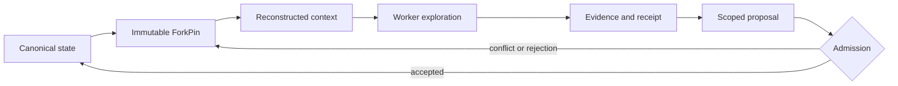

# Horseness

Horseness is a local-first, provider-neutral orchestration substrate for reliable multi-agent work.

A main agent coordinates the run, while specialized workers explore immutable forks. Workers can publish output, evidence, receipts, and scoped delta proposals, but they cannot silently rewrite shared state. Only an authorized, evidence-gated decision advances the canonical working state.

## The problem

A main agent with multiple subagents is powerful, but ordinary session handoffs are fragile:

- summaries lose constraints and provenance;
- concurrent workers can overwrite one another's conclusions;
- workers may reason from different code, policy, or dependency states;
- conversation compaction is lossy and cannot be replayed deterministically;
- later repair work inherits whatever the main agent happens to remember.

Horseness makes the provider session disposable. Correct working knowledge lives in durable, versioned state instead.

## The closed loop

```text
subagent exploration
  -> authenticated output and evidence
  -> sealed, scoped delta proposal
  -> deterministic evidence-gated admission
  -> revisioned canonical working state
  -> automatic context reconstruction
  -> dependency-aware downstream fork
  -> further exploration
```

Only `DeltaAccepted` changes canonical state. Submitted work may instead be rejected, conflicted, quarantined, or require approval; none of those outcomes silently mutates the shared document.

## How it works

### Immutable worker views

Every worker receives a content-addressed `ForkPin` that fixes the canonical revision, source cursor, dependency snapshot, policy, ancestry, and allowed delta scope. Newer state appears only through an explicit fork refresh.

### Evidence-gated changes

A proposal binds its fork, base state, receipt lineage, evidence, authorization, and ordered operations with value preconditions. Admission checks identity, scope, authenticity, conflicts, current authorization, and both pinned and current policy before accepting it.

### Reconstructable context

Context is built from durable sources rather than copied from a long chat transcript. A versioned manifest records selected source digests, ordering, byte ranges, omissions, budget, renderer version, and final output digest. Restart or replay from the same fork reconstructs identical context bytes.

### Dependency-aware continuation

Tasks form a durable DAG. Downstream work starts only when its declared upstream outcomes are satisfied. Its fork captures the exact join snapshot and accepted canonical revision, so later repair begins from verified state rather than conversational memory.



## Design rule

> A worker conclusion is candidate information until it is bound to a fork, scope, receipt, evidence, and preconditions, then accepted by the authority. Only then is it canonical truth.

A useful approximation is:

```text
Git-like immutable forks
+ database transactions
+ content-addressed evidence
+ deterministic context builds
+ policy-gated pull requests
+ a dependency-aware task scheduler
```

See [Design Principle](docs/DESIGN_PRINCIPLE.md) for the complete rationale and closed-loop model.

## Architecture

Horseness uses Node.js 22, strict TypeScript, ESM, pnpm, SQLite WAL, append-only event streams, and content-addressed artifacts. The provider-neutral core is exposed through a local daemon, CLI, SDK, and native Pi, OMP, Claude Code, and Codex adapters. Adapters translate host capabilities; they do not own canonical state or admission policy.

Normative references:

- [Architecture](docs/architecture.md)
- [Deterministic context reconstruction](docs/context.md)
- [Delivery plan](docs/plan.md)
- [Current progress and blockers](docs/progress.md)

## Development status

The core, daemon, CLI, installer library, and all four native adapters are implemented. C22 is preparing a fourteen-package npm-first `1.0.0` release; exact public packages will be published under `next`, verified on Linux, macOS, and Windows, then promoted to `latest`. The fixture-mode self-contained bootstrap and offline distribution are deferred. Current release progress is tracked in [docs/progress.md](docs/progress.md).

## Repository development

Requirements: Node.js 22 and pnpm 10. The exact pnpm version is declared in `package.json`.

```bash
corepack pnpm install --frozen-lockfile
corepack pnpm run typecheck
corepack pnpm run lint
corepack pnpm run test
corepack pnpm run boundaries:check
```
