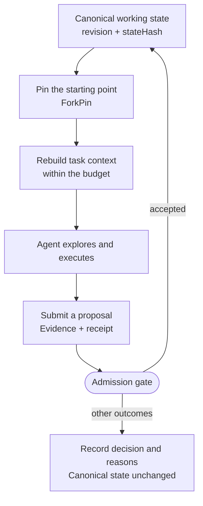
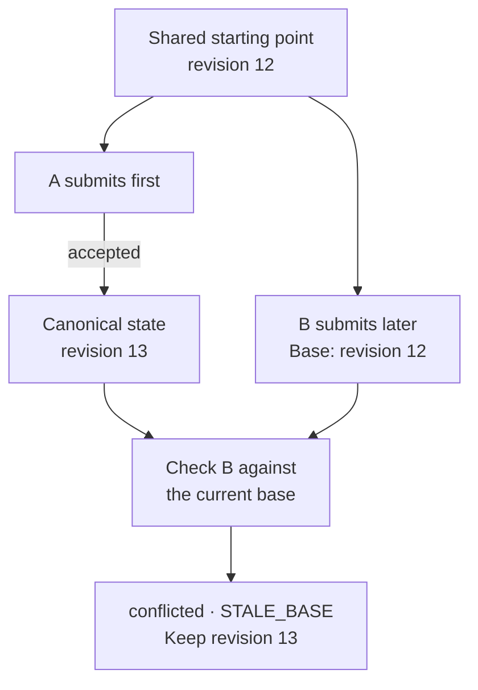
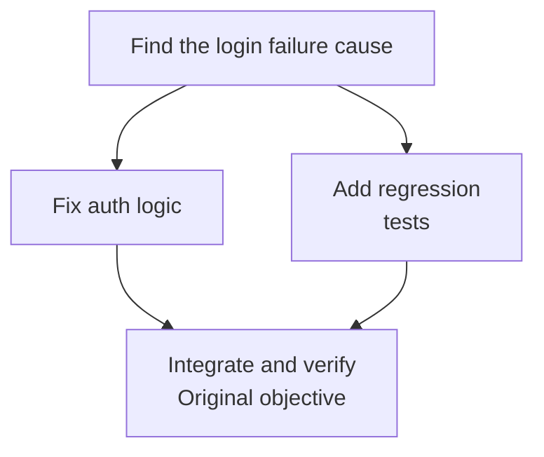

# Horseness


**Let agents explore independently—not independently decide what counts as the final conclusion.**

Horseness is a local-first state machine for multi-agent work: versioned working state, evidence-gated changes, and replayable context. It connects Pi, OMP, Claude Code, and Codex rather than replacing those native hosts.

**English** · [简体中文](README.zh.md) · [Quick start](#quick-start) · [Status](#status)

## What problem does it solve?

One agent investigates a login failure while another prepares a fix. After several handoffs and session compressions, the hard questions are: **Which version supports this conclusion? Where is its evidence? Can an old conclusion overwrite a newer one?**

Horseness does not treat a chat summary as authoritative. Candidate changes pass through one explicit admission boundary:


```mermaid
flowchart TD
    S["Canonical working state<br/>revision + stateHash"]
    P["Pin the starting point<br/>ForkPin"]
    C["Rebuild task context<br/>within the budget"]
    W["Agent explores and executes"]
    D["Submit a proposal<br/>Evidence + receipt"]
    G(["Admission gate"])
    N["Record decision and reasons<br/>Canonical state unchanged"]
    S --> P --> C --> W --> D --> G
    G -->|accepted| S
    G -->|other outcomes| N
```

Canonical state is the accepted, structured working document—not the conversation and not an agent saying “done.” Only `DeltaAccepted` advances its revision; tasks, receipts, and decisions have separate durable records.

A `ForkPin` fixes the state version, visible evidence, modification scope, and dependency snapshot. Context is rebuilt only from persistent data visible at that pin; the same pin and renderer configuration reproduce the same context. Items exceeding the budget are omitted whole, with a record of omissions, rather than silently truncated.

## Example: an old conclusion cannot silently win

Suppose two agents investigate login logic from `revision 12`, and both pass identity, authority, and evidence checks:


```mermaid
flowchart TD
    R["Shared starting point<br/>revision 12"]
    A["A submits first"]
    B["B submits later<br/>Base: revision 12"]
    S["Canonical state<br/>revision 13"]
    G["Check B against<br/>the current base"]
    X["conflicted · STALE_BASE<br/>Keep revision 13"]
    R --> A
    R --> B
    A -->|accepted| S
    S --> G
    B --> G
    G --> X
```

B does not win by writing last. Continuing requires an explicit pin refresh, inspection of the new state, and a new proposal with lineage; the original proposal and conflict record remain unchanged.

Admission checks structure and identity, modification scope, evidence and receipts, base and operation preconditions, and **both the pinned and current policies**. There are exactly five outcomes:

| Outcome | Meaning and next step |
|---|---|
| `accepted` | The change is admitted; canonical state advances one revision. |
| `conflicted` | The base or an operation precondition no longer holds; propose against an explicit updated state. |
| `rejected` | Structure, authority, evidence, policy, or another validation failed; identical retries cannot bypass rejection. |
| `quarantined` | Held for review; release still requires full re-evaluation. |
| `approval_required` | Waiting for authorized approval; approval is not acceptance and still requires re-evaluation. |

## Quick start

**The npm release is not published yet.** Run from a checkout with Node.js 22 and the repository-pinned pnpm. Install dependencies at the repository root, then switch to an existing target project; replace the example path below:

```sh
corepack pnpm install --frozen-lockfile
HORSENESS="$PWD/apps/cli/bin/horseness.mjs"
export HORSENESS_DAEMON_EXECUTABLE="$PWD/apps/daemon/bin/horseness-daemon.mjs"

cd /absolute/path/to/your/project
"$HORSENESS" init
"$HORSENESS" run create --title "Fix login"
"$HORSENESS" task add --title "Inspect authentication"
"$HORSENESS" status
"$HORSENESS" task list
```

- A **workspace** is the project; a **run** is one work session; a **task** is a work item within it.
- `init` initializes the project and connects to or starts its local daemon; it does not install native hosts. Subsequent CLI commands discover the workspace, select the current run, and handle cursors, creation IDs, and idempotency keys.
- `task add` creates a durable draft. **It does not call a model.**

### Explicitly execute one task

In the same terminal, replace `TASK_ID` with an ID from `task list` and `PROVIDER/MODEL` with a real model identifier:

```sh
"$HORSENESS" task dispatch --task TASK_ID --adapter pi --model PROVIDER/MODEL
"$HORSENESS" task show --task TASK_ID
```

Prepare a supported native host version and its authentication session first. This example selects Pi; `omp`, `claude`, and `codex` are also explicit choices. Model identifiers are host-specific; there is no automatic host or model substitution. See [CLI prerequisites](docs/cli.md#native-runtime-prerequisites) for versions and authorization requirements.

> **Launch acknowledgement ≠ task completion ≠ accepted conclusion.** `dispatch` returns a durable launch acknowledgement; use `task show` to inspect progress, authenticated receipts, and output. Daily CLI tasks default to receipt-only completion, without requiring an unrelated canonical change; tasks that require an accepted change must satisfy that declared completion condition.

Inspect an unknown outcome rather than treating it as failure and launching again. After an interruption, explicitly repeat the exact command and options to recover the original operation instead of blindly retrying a changed request.

If matching executables are already on `PATH`, use `horseness` instead of `"$HORSENESS"`. Use `--workspace PATH` for another project, `--json` for scripts, and `--help` for commands. See [CLI usage](docs/cli.md) for existing-workspace authorization, cancellation, and recovery.

## Larger work: review a plan, then follow dependencies

“Fix login” can first become a task graph. **Arrows represent prerequisites, not a promise of parallel execution**; current `task execute` runs serially in dependency order.


```mermaid
flowchart TD
    A["Find the login failure cause"]
    B["Fix auth logic"]
    C["Add regression<br/>tests"]
    D["Integrate and verify<br/>Original objective"]
    A --> B
    A --> C
    B --> D
    C --> D
```

A downstream task can pin its dependency snapshot and start only after its dependencies satisfy their frozen completion conditions. It receives traceable upstream results, not just “the previous agent said it was ready.”

### Review before execution

While the original objective is still a draft, use its ID as `TASK_ID`. Run these steps individually: inspect the preview's instructions, acceptance criteria, and dependencies before replacing `PLAN_DIGEST` with its digest.

```sh
"$HORSENESS" task breakdown --task TASK_ID --planner pi --model PROVIDER/MODEL
"$HORSENESS" task show --task TASK_ID
# Wait for the preview and review it before running the next two commands.
"$HORSENESS" task adopt --task TASK_ID --plan PLAN_DIGEST
"$HORSENESS" task execute --task TASK_ID --adapter pi --model PROVIDER/MODEL
```

`breakdown` runs only the planner, not the child tasks; `adopt` adopts the exact reviewed plan and creates its dependency graph. The original objective remains the final integration task—it is not completed merely because planning finished.

### Explicitly authorize automatic composition

If step-by-step review is not needed, use this **alternative** on a draft objective rather than running it again after the sequence above:

```sh
"$HORSENESS" task execute --task TASK_ID --adapter pi --model PROVIDER/MODEL --auto-plan
```

It combines planning, adoption, and execution, using the same host and model for planning by default. Automatic mode does not bypass grants, policy, quota, dependencies, or cancellation; it stops on failed dependencies, denial, or an unknown outcome.

## When to use it—and its limits

**Use it for** long-running, multi-agent engineering work that needs traceability and follow-up fixes. For a small one-off task, defining scope and dependencies, structuring changes, and retaining evidence may cost more than they save.

- **It verifies rules, not truth.** Admission checks encoded rules and evidence bindings, not semantic correctness. A bad task contract or policy can still produce a bad result.
- **It separates state versions, not OS processes.** A `ForkPin` is neither a Git branch nor a filesystem sandbox. Native tools retain their host's OS-user privileges; canonical admission does not intercept their writes to project files.
- **It replays state and context, not model behavior.** Reconstructing inputs and history does not guarantee that another model call produces the same output.

## Status

According to the [progress ledger](docs/progress.md), C00–C22 are complete: the core, CLI/daemon, four host adapters, installation/system verification, and the fourteen-package npm candidate have recorded delivery evidence.

Public release is next: C23 publishes `next` → C24 verifies public packages on Linux/macOS/Windows → C25 promotes `latest`. Publication requires external npm/GitHub authority configuration; repository acceptance is not a completed public release. Self-contained bootstrap and offline distribution are outside the first release.

## Development and verification

From the repository root, with Node.js 22 and frozen dependencies installed:

| Command | Verification scope |
|---|---|
| `corepack pnpm run test` | All package unit/integration tests plus root boundary and historical receipt checks. |
| `corepack pnpm run test:security` | Focused authorization, hostile-input, artifact, recovery, and installer security regressions. |
| `corepack pnpm run test:e2e` | Linux system/installer blackboxes and real CLI → daemon → digest-verified Pi execution, planning, dependencies, cancellation, and recovery. |
| `corepack pnpm run host:harness:test` | Separate native-host feasibility and validator suite. |

PR/push CI runs the default package suite and Linux e2e. E2e uses real Pi with a controlled, loopback-only provider; acquisition and installation require npm registry access, not model-provider credentials. Scenarios use disposable workspaces and clean up their processes.

The four-host `test:closed-loop` gate is separate and requires its native-host/session prerequisites. Linux e2e does not establish live-provider authentication, all-host parity, cross-OS native e2e, or complete branch coverage; see the [evidence ledger](docs/progress/C22.md) for observed scope.

## Further reading

| Question | Document |
|---|---|
| Commands, host setup, authorization, and interrupted operations | [CLI usage](docs/cli.md) |
| Main-agent responsibilities, admission, and context reconstruction | [Design principles](docs/DESIGN_PRINCIPLE.md) |
| Why this design, worked examples, and tradeoffs | [Design choices](docs/DESIGN_CHOICE.md) |
| Product invariants and state semantics | [Architecture](docs/architecture.md) |
| Delivery boundaries, path ownership, and acceptance commands | [Delivery plan](docs/plan.md) |
| What is complete and where its evidence lives | [Progress ledger](docs/progress.md) |
