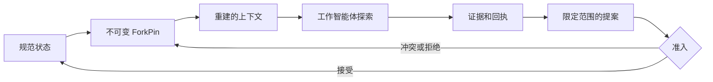

# Horseness

Horseness 是一个本地优先、供应商中立的编排基础层，用于可靠的多智能体协作。

主智能体负责协调一次运行，专门化工作智能体则在不可变分支上探索。工作智能体可以发布输出、证据、回执以及限定范围的增量提案，但不能静默改写共享状态。只有经过授权且通过证据门控的决策，才能推进规范工作状态。

## 问题

一个主智能体配合多个子智能体非常强大，但常规的会话交接很脆弱：

- 摘要会丢失约束和来源信息；
- 并发工作智能体可能互相覆盖结论；
- 不同工作智能体可能基于不同的代码、策略或依赖状态进行推理；
- 对话压缩是有损的，无法进行确定性重放；
- 后续修复工作只能继承主智能体碰巧记得的内容。

Horseness 使供应商会话变得可丢弃。正确的工作知识改为存放在持久、版本化的状态中。

## 闭环

```text
子智能体探索
  -> 经过认证的输出和证据
  -> 已密封、限定范围的增量提案
  -> 确定性的证据门控准入
  -> 版本化的规范工作状态
  -> 自动重建上下文
  -> 感知依赖的下游分支
  -> 继续探索
```

只有 `DeltaAccepted` 会改变规范状态。提交的工作也可能被拒绝、判定冲突、隔离或要求审批；这些结果都不会静默修改共享文档。

## 工作方式

### 不可变的工作智能体视图

每个工作智能体都会收到一个内容寻址的 `ForkPin`，其中固定了规范修订、来源游标、依赖快照、策略、祖先关系以及允许的增量范围。只有显式刷新分支后，较新的状态才会出现。

### 证据门控的变更

提案将其分支、基础状态、回执沿袭关系、证据、授权以及带值前置条件的有序操作绑定在一起。准入流程会先检查身份、范围、真实性、冲突、当前授权，以及固定策略与当前策略，然后才决定是否接受。

### 可重建的上下文

上下文由持久来源构建，而不是从冗长的聊天记录中复制。版本化清单记录所选来源的摘要、顺序、字节范围、省略项、预算、渲染器版本和最终输出摘要。从同一分支重启或重放时，会重建出完全相同的上下文字节。

### 感知依赖的延续

任务构成持久的有向无环图。只有声明的上游结果得到满足，下游工作才会开始。下游分支会捕获精确的汇合快照和已接受的规范修订，因此后续修复从经过验证的状态开始，而不是依赖对话记忆。



## 设计规则

> 工作智能体的结论只是候选信息；只有当它绑定到分支、范围、回执、证据和前置条件，并由权威方接受后，才会成为规范事实。

可以近似理解为：

```text
类似 Git 的不可变分支
+ 数据库事务
+ 内容寻址的证据
+ 确定性的上下文构建
+ 策略门控的拉取请求
+ 感知依赖的任务调度器
```

完整的设计依据和闭环模型参见[设计原则](docs/DESIGN_PRINCIPLE.zh.md)。

## 架构

Horseness 使用 Node.js 22、严格模式 TypeScript、ESM、pnpm、SQLite WAL、仅追加事件流和内容寻址制品。供应商中立的核心通过本地守护进程、CLI、SDK，以及 Pi、OMP、Claude Code 和 Codex 原生适配器提供。适配器负责转换宿主能力，但不拥有规范状态或准入策略。

规范性参考资料：

- [架构](docs/architecture.md)
- [确定性上下文重建](docs/context.md)
- [交付计划](docs/plan.md)
- [当前进度和阻塞项](docs/progress.md)

## 开发状态

核心、守护进程、CLI、安装器库和四个原生适配器均已实现。C22 正在准备包含十四个包的 npm-first `1.0.0` 发布：先以 `next` 发布精确公共包，在 Linux、macOS 和 Windows 上验证，再提升为 `latest`。基于 fixture 的自包含 bootstrap 和离线分发已推迟。当前发布进度记录在 [docs/progress.md](docs/progress.md) 中。

## 仓库开发

要求：Node.js 22 和 pnpm 10。准确的 pnpm 版本在 `package.json` 中声明。

```bash
corepack pnpm install --frozen-lockfile
corepack pnpm run typecheck
corepack pnpm run lint
corepack pnpm run test
corepack pnpm run boundaries:check
```
