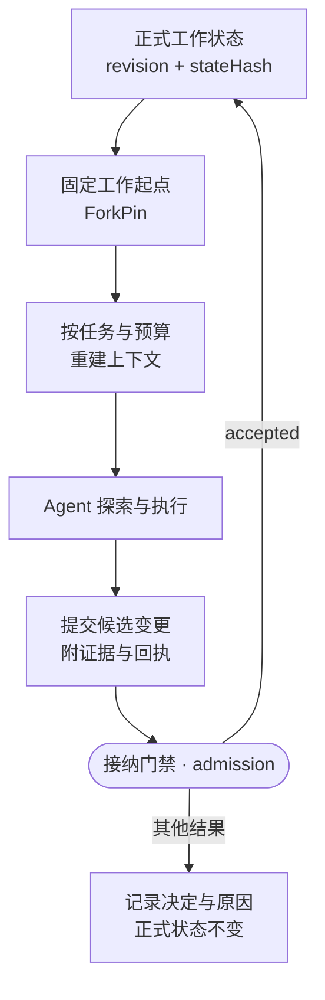
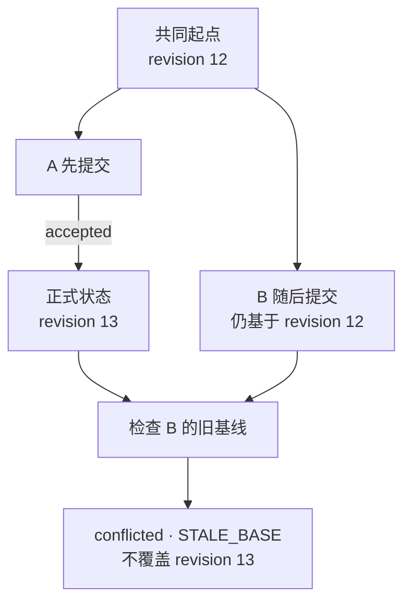
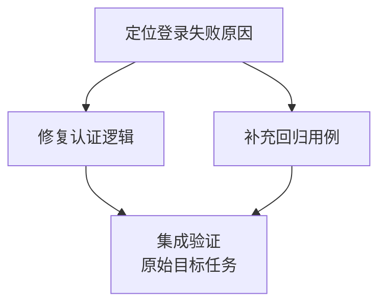

# Horseness


**让多个 Agent 各自探索，但不让它们各自宣布什么是最终结论。**

Horseness 是本地优先的多 Agent 协作状态机：为工作状态加上版本控制、证据门禁和可重放的上下文。它连接 Pi、OMP、Claude Code 和 Codex，不替代这些原生宿主。

[English](README.md) · **简体中文** · [快速上手](#快速上手) · [当前状态](#当前状态)

## 它解决什么问题

让一个 Agent 排查登录故障，另一个准备修复。几轮交接和会话压缩后，真正难回答的是：**结论基于哪个版本？证据在哪里？旧结论会不会覆盖新结论？**

Horseness 不把聊天摘要直接当成正式结论，而是让候选变更经过一个明确的入口：


```mermaid
flowchart TD
    S["正式工作状态<br/>revision + stateHash"]
    P["固定工作起点<br/>ForkPin"]
    C["按任务与预算<br/>重建上下文"]
    W["Agent 探索与执行"]
    D["提交候选变更<br/>附证据与回执"]
    G(["接纳门禁 · admission"])
    N["记录决定与原因<br/>正式状态不变"]
    S --> P --> C --> W --> D --> G
    G -->|accepted| S
    G -->|其他结果| N
```

这里的“正式状态”是系统已接纳的结构化工作文档，不是整段聊天，也不是“模型说自己做完了”。只有 `DeltaAccepted` 能推进它的版本；任务、回执和决定另有持久记录。

`ForkPin` 固定状态版本、可见证据、修改范围与依赖快照。上下文只从这个起点可见的持久化数据重建；同样的起点与渲染配置可重放同样的上下文。超出预算的内容整项省略并留痕，而不是无记录地截断。

## 例子：旧结论不会悄悄覆盖新结论

假设两个 Agent 都从 `revision 12` 开始检查登录逻辑，且身份、权限与证据检查均通过：


```mermaid
flowchart TD
    R["共同起点<br/>revision 12"]
    A["A 先提交"]
    B["B 随后提交<br/>仍基于 revision 12"]
    S["正式状态<br/>revision 13"]
    G["检查 B 的旧基线"]
    X["conflicted · STALE_BASE<br/>不覆盖 revision 13"]
    R --> A
    R --> B
    A -->|accepted| S
    S --> G
    B --> G
    G --> X
```

B 不是“后写入者胜出”。继续工作需要显式刷新起点、检查新状态，再提交有沿袭关系的新提案；原提案和冲突记录不会被改写。

门禁检查结构与身份、修改范围、证据与回执、版本与操作前置条件，以及**起点锁定的策略和当前策略**。结果只有五种：

| 结果 | 含义与后续 |
|---|---|
| `accepted` | 变更被接纳，正式状态推进一个版本。 |
| `conflicted` | 基线或操作前置条件不再成立；重新基于明确的状态提案。 |
| `rejected` | 结构、权限、证据或策略等检查失败；不能原样重试来绕过拒绝。 |
| `quarantined` | 暂时隔离；解除隔离后仍须完整重验。 |
| `approval_required` | 等待授权审批；审批不等于接纳，仍须重验。 |

## 快速上手

**npm 版本尚未发布。** 目前从源码运行，需要 Node.js 22 和仓库固定的 pnpm。先在仓库根目录安装依赖，再切换到一个已存在的目标项目；替换下方示例路径：

```sh
corepack pnpm install --frozen-lockfile
HORSENESS="$PWD/apps/cli/bin/horseness.mjs"
export HORSENESS_DAEMON_EXECUTABLE="$PWD/apps/daemon/bin/horseness-daemon.mjs"

cd /absolute/path/to/your/project
"$HORSENESS" init
"$HORSENESS" run create --title "修复登录问题"
"$HORSENESS" task add --title "检查认证代码"
"$HORSENESS" status
"$HORSENESS" task list
```

- **workspace** 是当前项目；**run** 是一次工作过程；**task** 是其中一个工作项。
- `init` 初始化项目并连接或启动本地 daemon，不安装原生宿主。之后 CLI 自动发现工作区、选择当前 run，并处理 cursor、创建 ID 和幂等键。
- `task add` 只创建持久化草稿，**不会调用模型**。

### 显式执行一个任务

在同一终端中，用 `task list` 返回的 ID 替换 `TASK_ID`，用真实模型标识替换 `PROVIDER/MODEL`：

```sh
"$HORSENESS" task dispatch --task TASK_ID --adapter pi --model PROVIDER/MODEL
"$HORSENESS" task show --task TASK_ID
```

执行前须准备受支持版本的原生宿主及其认证会话。上例选择 Pi，也可显式选择 `omp`、`claude` 或 `codex`；模型标识依宿主而定，不会自动换宿主或模型。具体版本和授权要求见 [CLI 前置条件](docs/cli.md#native-runtime-prerequisites)。

> **启动确认 ≠ 任务完成 ≠ 结论被接纳。** `dispatch` 返回持久化启动确认；用 `task show` 查看执行进度、经过验证的回执和输出。日常新建任务默认按有效回执判定完成，不要求无关的正式状态变更；需要变更被接纳的任务，必须满足它声明的完成条件。

结果不明时先检查，不要当成失败直接重启。中断后应显式重放同一命令及参数来恢复原操作，而不是改动请求后盲重试。

已有匹配版本的可执行程序在 `PATH` 时，可用 `horseness` 替代 `"$HORSENESS"`。`--workspace PATH` 选择其他项目，`--json` 供脚本使用，`--help` 查看命令。旧工作区授权、取消和恢复见 [CLI 使用说明](docs/cli.md)。

## 大任务：先看计划，再按依赖执行

“修复登录问题”可以先拆成一个任务图。**箭头表示前置依赖，不表示一定并行执行**；当前 `task execute` 按依赖顺序串行运行。


```mermaid
flowchart TD
    A["定位登录失败原因"]
    B["修复认证逻辑"]
    C["补充回归用例"]
    D["集成验证<br/>原始目标任务"]
    A --> B
    A --> C
    B --> D
    C --> D
```

下游只有在依赖的冻结完成条件满足后，才能固定其依赖快照并启动；它接收的是可追溯的上游结果，不是“上一个 Agent 说可以了”。

### 审阅后执行

在原始目标仍为草稿时，用它的 ID 替换 `TASK_ID`。以下命令分步执行：先查看预览中的指令、验收要求与依赖，再用其摘要替换 `PLAN_DIGEST`。

```sh
"$HORSENESS" task breakdown --task TASK_ID --planner pi --model PROVIDER/MODEL
"$HORSENESS" task show --task TASK_ID
# 等预览就绪并审阅后，再运行下面两条命令。
"$HORSENESS" task adopt --task TASK_ID --plan PLAN_DIGEST
"$HORSENESS" task execute --task TASK_ID --adapter pi --model PROVIDER/MODEL
```

`breakdown` 只运行规划者，不启动子任务；`adopt` 只采用你指定的计划并创建依赖图。原始目标保留为最后的集成任务，不会因为“拆解完了”就被标记完成。

计划需要调整时，**先不要 `adopt`**，导出并编辑任务 JSON：

```sh
"$HORSENESS" task export-plan --task TASK_ID --out plan.json
# 编辑 plan.json，再用导出时显示的摘要替换 PLAN_DIGEST。
"$HORSENESS" task revise --task TASK_ID --plan PLAN_DIGEST --file plan.json
"$HORSENESS" task show --task TASK_ID
```

可以增删子任务，修改指令、验收要求和依赖。修改只保存新的不可变预览，不启动工作；审阅后，用**新返回的摘要**执行上面的采用命令。原预览保留，过期基线会被拒绝，已经采用的任务图不能原地修改。JSON 格式和中断恢复见[计划修改说明](docs/cli.md#edit-a-breakdown-before-adoption)。采用任务计划不等于批准正式状态变更。

### 显式授权自动组合

若不需要逐步审阅，可对草稿目标**改用**以下命令，而不是接着重复运行：

```sh
"$HORSENESS" task execute --task TASK_ID --adapter pi --model PROVIDER/MODEL --auto-plan
```

它组合规划、采用和执行；默认使用同一宿主与模型规划。自动模式不会绕过权限、策略、配额、依赖或取消，遇到依赖失败、拒绝或未知结果会停止。

## 适用场景与边界

**适合**长时间、多 Agent、需要追溯与后续修复的工程任务。一次性小任务可能不值得付出定义范围、依赖、结构化变更和保存证据的成本。

- **验证规则，不判定真理。** 门禁检查已编码的规则与证据绑定，不自动判断结论在语义上正确；错误的任务约定或策略仍可能导致错误结果。
- **隔离状态版本，不隔离操作系统。** `ForkPin` 不是 Git 分支，也不是文件系统沙箱；原生工具仍按宿主的 OS 用户权限运行。正式状态的接纳门禁不拦截它们对项目文件的写入。
- **重放状态与上下文，不保证模型复现。** 可重建输入与历史，不代表再次调用模型会得到同样输出。

## 当前状态

按[进度总账](docs/progress.md)，C00–C22 已完成：核心、CLI/daemon、四宿主适配、安装与系统验证，以及十四个 npm 包的候选准备均有记录。

公开发布仍是下一阶段：C23 发布 `next` → C24 在 Linux/macOS/Windows 验证公开包 → C25 推进 `latest`。发布需要外部 npm/GitHub 权限配置；仓库验收通过不等于已完成公开发行。自包含 bootstrap 和离线分发不在首发范围内。

## 开发与验证

在仓库根目录，使用 Node.js 22 和已安装的冻结依赖：

| 命令 | 验证范围 |
|---|---|
| `corepack pnpm run test` | 全部 package 单元/集成测试，以及根目录边界与历史回执检查。 |
| `corepack pnpm run test:security` | 授权、恶意输入、artifact、恢复和安装器安全回归。 |
| `corepack pnpm run test:e2e` | Linux 系统/安装黑盒，以及真实 CLI → daemon → 摘要校验后的 Pi：执行、拆解、依赖、取消与恢复。 |
| `corepack pnpm run host:harness:test` | 独立的原生宿主可行性与校验器测试。 |

PR/push CI 运行默认 package 测试和 Linux e2e。e2e 使用真实 Pi 与仅监听本机的受控 provider；获取、安装需要 npm registry 访问，不需要模型服务凭据。场景使用临时工作区并清理自己的进程。

四宿主 `test:closed-loop` 是独立门禁，需要其原生宿主与登录会话前置条件。Linux e2e 不证明真实模型认证、四宿主等价性、跨 OS 原生 e2e 或全部分支覆盖；实际验证范围见[证据记录](docs/progress/C22.md)。

## 延伸阅读

| 想了解 | 文档 |
|---|---|
| 命令、宿主准备、授权与中断恢复 | [CLI 使用说明](docs/cli.md) |
| 主 Agent 职责、接纳规则与上下文重建 | [设计原则](docs/DESIGN_PRINCIPLE.zh.md) |
| 为什么这样设计、完整推演与取舍 | [设计取舍](docs/DESIGN_CHOICE.md) |
| 产品不变量与状态语义 | [架构规范](docs/architecture.md) |
| 交付边界、路径归属与验收命令 | [交付计划](docs/plan.md) |
| 已完成什么、证据在哪里 | [进度总账](docs/progress.md) |
