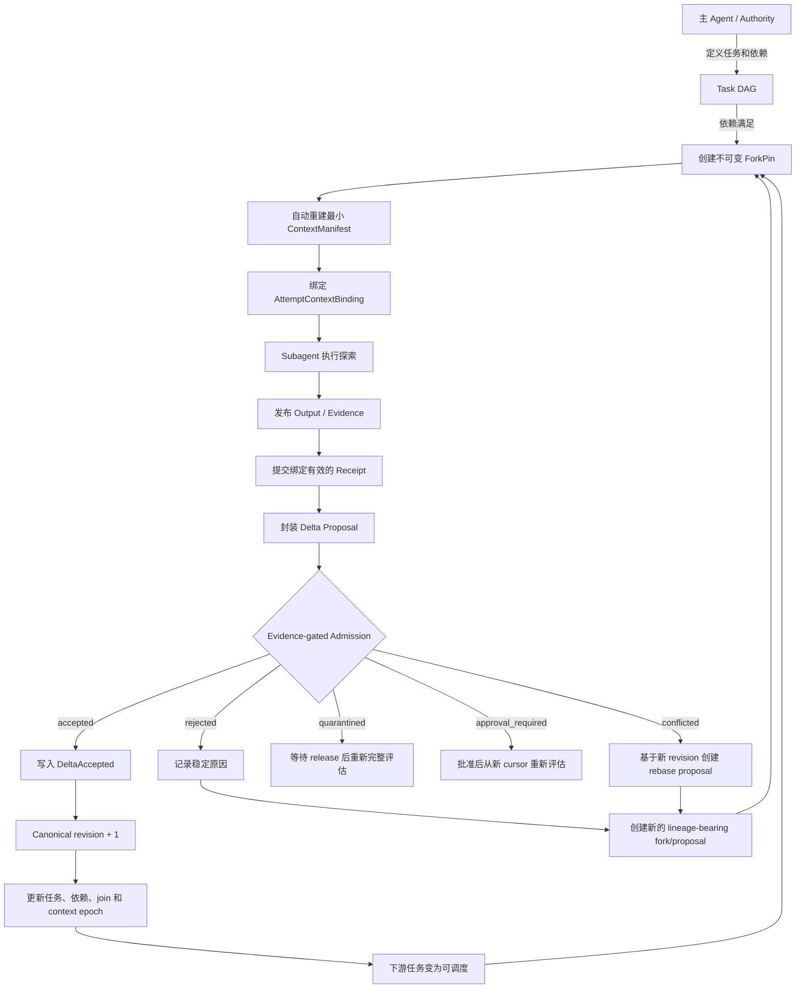

# Design choice

Original Idea: [https://t.me/leetao_space/1914](https://t.me/leetao_space/1914)
```
一个主 agent + 多个 subagent 处理一个任务感觉可能是效果最好的搭配，另外当subagent 发现什么和主 Agent 不一样的内容可以告知 主 Agent  然后主 Agent 对自己的 session 进行裁剪，保留最少的正确的上下文；这样子的话，主 Agent 噪音最少，后续出现新的问题的时候，基于主 Agent 在 fork 然后再去修复问题，这样子效果质量有没有可能达到最佳？

找了不少开源的项目，都覆盖了我的想法部分内容，目前还没有发现一个开源项目把 subagent exploration + evidence gated state delta + 主 Agent canonical working state + 自动 context reconstruction + dependency aware fork 完整串成一个闭环
```

## 研究结论

对，这个方向有机会显著提高质量，但关键不是“主 Agent 定期把聊天记录压短”，而是：

> **把主 Agent 的正确认知从 session 文本里移出，变成一个可验证、可重放、版本化的 canonical working state。**

Horseness 解决的正是这个闭环。当前架构不是让 subagent 直接修改主 Agent 的记忆，而是：

1. 主 Agent 持有唯一 canonical state；
2. subagent 从确定版本创建不可变 fork；
3. subagent 独立探索并产出 evidence；
4. subagent 提交有范围、有前置条件的 delta proposal；
5. authority 确定性审查；
6. 只有 `accepted` proposal 才产生 `DeltaAccepted`；
7. canonical revision 前进；
8. 后续 Agent 从事件、canonical state、依赖结果和 evidence 自动重建最小上下文；
9. 新问题从新的 canonical revision 创建 dependency-aware fork；
10. 重复整个过程。

这不是“共享聊天记忆”，而是一个**带版本控制、证据门禁和确定性重建的多 Agent 状态机**。

---

# 一张图看完整闭环



---

## 1. 主 Agent 不直接保存“大段正确上下文”

你的原始设想是：

> subagent 发现主 Agent 不知道或理解错误的内容，然后告诉主 Agent；主 Agent 裁剪 session，留下最少的正确上下文。

问题在于，普通 session compaction 有几个缺陷：

- 摘要可能遗漏约束；
- 无法证明某个结论来自什么 evidence；
- 新旧事实容易混合；
- 并发 subagent 可能互相覆盖；
- 无法精确重放；
- 很难判断“这个结论是在哪个代码版本上成立的”。

Horseness 把状态拆成两层。

### Canonical working state

真正由主 Agent/authority 拥有：

```ts
CanonicalDocument = {
  runId,
  revision,
  document,
  stateHash,
  hashAlgorithmVersion,
  canonicalizerVersion,
  acceptedProposalId,
  lastCanonicalEventSequence
}
```

只有 `DeltaAccepted` 能修改它，而且：

```text
revision := revision + 1
stateHash := hash(canonicalJson(newDocument))
```

因此“主 Agent 当前认为正确的内容”不再依赖聊天窗口，而是一个带 revision 和 hash 的确定状态。

### Operational state

另外保存：

- tasks；
- dependencies；
- attempts；
- forks；
- receipts；
- evidence；
- proposals；
- admission decisions；
- approvals；
- context manifests；
- dispatch/recovery 状态。

这些信息不会随意塞进 canonical document，也不会因为 operational 事件就修改 canonical revision。

这解决了“事实”和“运行过程噪音”混在一起的问题。

---

## 2. Subagent 不直接改主 Agent 状态

每个 subagent 开始工作前获得一个不可变 `ForkPin`：

```ts
ForkPinCoreV1 = {
  canonicalRevision,
  canonicalStateHash,
  sourceObservationCursor,
  sourceContextVersion,
  dependencyJoinSnapshotDigest,
  deltaAuthorityScopeDigest,
  pinnedPolicyDigest,
  ancestry,
  ...
}
```

它回答四个重要问题：

1. 这个 subagent 是从 canonical 哪个 revision 出发的？
2. 当时它能看到哪些 receipt、evidence 和依赖结果？
3. 它允许修改 canonical document 的哪些路径？
4. 它的父 fork 和 refresh lineage 是什么？

例如两个 subagent 同时工作：

```text
Canonical revision 12
├── Fork A：调查数据库竞态
└── Fork B：调查上下文污染
```

两者都从 revision 12 出发，但不会直接修改 revision 12。

A 如果先被接受：

```text
revision 12 -> revision 13
```

B 仍然绑定 revision 12。B 的 proposal 不会“自动套用到 13”，而是检查前置条件：

- 如果 B 修改的位置未受 A 影响，可以按明确规则接受；
- 如果基础状态或目标值已经变化，返回 `conflicted`；
- B 必须创建带 lineage 的 rebase/amendment proposal。

这样避免了“最后一个 subagent 的消息覆盖前面的正确结论”。

---

## 3. Subagent 如何“告知主 Agent 自己发现了不同内容”

不是发一句自然语言：

> 我觉得主 Agent 前面的理解不对。

而是走完整的 `WorkerReturnV1`：

```text
发布 output/evidence
    ↓
提交 AttemptReceiptEnvelopeV1
    ↓
封装 ProposalEnvelopeCoreV1
    ↓
提交 admission
    ↓
获得 accepted/rejected/conflicted/...
```

Proposal 需要包含：

- 精确 base revision/state hash；
- ForkPin digest；
- 允许修改的 delta scope；
- attempt/receipt lineage；
- evidence claims；
- proposal sealing cursor；
- 有前置条件的 delta operations。

例如，subagent 发现 canonical state 中：

```json
{
  "rootCause": "token limit"
}
```

实际证据证明根因是 stale context binding。

它不能仅提交：

```json
{
  "rootCause": "stale context binding"
}
```

而应提交类似：

```ts
[
  {
    op: "test",
    path: "/rootCause",
    expectedValueDigest: digest("token limit")
  },
  {
    op: "replace",
    path: "/rootCause",
    expectedValueDigest: digest("token limit"),
    value: "stale context binding"
  }
]
```

并绑定相应 evidence。

如果主 Agent canonical state 已经被另一个 proposal 改成别的内容，`expectedValueDigest` 不匹配，结果就是 `conflicted`，不会静默覆盖。

---

## 4. Evidence-gated state delta 是质量核心

Admission 不是让 LLM 再“凭感觉评审一遍”，而是确定性检查：

### 第一层：结构和身份

- schema/version 是否有效；
- `proposalId` 是否确实从 `proposalDigest` 派生；
- JSON Pointer 是否规范；
- 是否存在重复或重叠写路径。

### 第二层：修改权限

- proposal scope 是否等于 ForkPin 绑定的 scope；
- 每个 operation 是否落在授权路径内；
- policy 不能扩大 delta scope。

### 第三层：证据真实性

- receipt 是否绑定正确 attempt/generation；
- context manifest 与 binding digest 是否匹配；
- evidence 是否已发布且 digest/size 正确；
- evidence 在 proposal sealing cursor 上是否可见；
- producer principal/grant 是否匹配。

### 第四层：并发冲突

- canonical base revision/hash 是否仍有效；
- `test`/`replace`/`remove` 前置条件是否成立；
- 目标路径是否被其他 accepted delta 改变。

### 第五层：当前授权与 policy

同时计算：

```text
fork-pinned policy AND current active policy
```

旧 policy 不能被当前更宽松的 policy 绕过；当前更严格的规则同样生效。

### 结果只有五种

```text
accepted
rejected
conflicted
quarantined
approval_required
```

只有：

```text
accepted -> DeltaAccepted -> canonical revision + 1
```

其他结果都不能修改 canonical working state。

---

## 5. “主 Agent 裁剪 session”实际由自动 context reconstruction 替代

这是你设想里最重要的升级。

不要让主 Agent自己决定：

> 哪些历史消息要留下，哪些要删除。

应该从 authority state 自动计算新的最小上下文。

项目里的 reconstruction 输入包括：

- objective；
- task contract；
- canonical slice；
- dependency outcomes；
- ForkPin；
- pin 上可见的 receipts；
- evidence；
- unresolved decisions；
- approvals；
- pinned/current policy；
- host/system instructions；
- compaction summaries；
- byte budget。

然后按照稳定顺序选择：

```text
priority
→ kind 的 UTF-8 顺序
→ sourceId
→ digest
```

预算不足时，不截断一个 source，而是整项省略并记录 omission：

```text
budget:<sourceId>
```

输出为：

```ts
ContextManifestCoreV1 = {
  forkPinDigest,
  sourceObservationCursor,
  sourceContextVersion,
  canonicalTuple,
  orderedSourceDescriptors,
  omissions,
  byteAccounting,
  renderedOutputDigest,
  ...
}
```

再绑定：

```ts
AttemptContextBindingV1 = {
  attemptId,
  generation,
  forkPinDigest,
  contextManifestCoreDigest,
  providerIdempotencyKey,
  allowedProducer,
  ...
}
```

因此真正的 compaction 是：

```text
完整持久状态
  ↓
按 ForkPin 选择可见状态
  ↓
按 task/scope 选择必要 source
  ↓
按固定预算确定性渲染
  ↓
得到 digest 可验证的最小上下文
```

而不是对聊天记录做有损摘要后，希望摘要没有漏掉关键约束。

---

## 6. Dependency-aware fork 负责后续修复

subagent 之间不应仅有“父子 session”关系，而应有正式任务依赖。

例如：

```text
T1：定位竞态
T2：验证持久化语义
T3：设计修复
T4：实现修复
T5：验证修复
```

依赖可定义为：

```text
T3 requires_success T1
T3 requires_success T2
T4 requires_success T3
T5 requires_success T4
```

每个 dependency outcome 绑定：

- source task；
- terminal event sequence；
- receipt/result digest；
- outcome；
- winning attempt generation；
- cursor。

当依赖满足时，系统产生 immutable join snapshot：

```ts
DependencyJoinSnapshotCoreV1 = {
  taskId,
  taskContractDigest,
  dependencies: [...],
  schedulability,
  reasonCodes
}
```

新 fork 再绑定该 snapshot digest。

所以后续修复 Agent 看到的不是：

> 前几个 Agent 好像都说修复方案可行。

而是：

> T1 和 T2 的特定 generation 已完成；对应 receipt/evidence digest 是 X/Y；基于 canonical revision 13 创建本次 ForkPin。

---

## 7. 一个具体闭环示例

假设主 Agent 当前 canonical state：

```json
{
  "problem": "context grows indefinitely",
  "hypothesis": "subagents should report summaries",
  "acceptedFacts": [],
  "solution": null
}
```

### 第一步：并行 exploration

创建三个任务：

```text
T1：调查 session compaction 的信息损失
T2：调查 subagent 并发写冲突
T3：调查可重放 context reconstruction
```

每个任务获得各自的 ForkPin 和 delta scope：

```text
T1 -> /acceptedFacts/compaction
T2 -> /acceptedFacts/concurrency
T3 -> /acceptedFacts/reconstruction
```

### 第二步：提交 evidence-bearing proposal

T1 提交：

```json
{
  "path": "/acceptedFacts/compaction",
  "value": {
    "finding": "free-form summary is not replayable",
    "evidenceDigest": "sha256:..."
  }
}
```

T2、T3 同理。

因为 scope 不重叠，三个 proposal 可以独立接受。

Canonical state 依次变为 revision 1、2、3。

### 第三步：依赖 join

当 T1–T3 都满足成功条件后，T4 才 ready：

```text
T4：综合闭环设计
```

T4 的 ForkPin 固定：

- canonical revision 3；
- 三个 dependency outcome；
- 三组 evidence；
- task contract；
- 允许写 `/solution`。

### 第四步：自动构建 T4 上下文

系统只选择：

- 当前 objective；
- canonical `/problem`；
- canonical `/acceptedFacts`；
- T1–T3 receipt/evidence；
- T4 contract；
- policy；
- system instructions。

不会重新塞入 T1–T3 的完整聊天记录。

### 第五步：接受解决方案

T4 提交：

```json
{
  "solution": {
    "model": "canonical-state + evidence-gated-delta",
    "context": "deterministic reconstruction",
    "forking": "dependency-aware immutable pins"
  }
}
```

Admission 验证后产生 `DeltaAccepted`。

### 第六步：出现新问题

如果后面发现 reconstruction 的 byte-budget 策略会漏掉某种高优先级证据：

```text
revision 4
└── Fork T5：修复 byte-budget selection
```

T5 从 revision 4 和对应依赖证据出发，不需要依赖原主 Agent 的完整 session。

这就是你说的：

> 基于主 Agent 再 fork，然后修复新问题。

但更准确地说，是：

> **基于 canonical revision + ForkPin + dependency snapshot fork，而不是基于主 Agent 当前自然语言 session fork。**

---

# 这个方案是否“效果最佳”？

不能保证绝对最佳。它主要优化的是：

- 长任务一致性；
- 多 Agent 并发安全；
- 可追溯性；
- 上下文可重放；
- 错误隔离；
- stale-context 检测；
- evidence 与结论绑定；
- 后续修复的精确基线。

代价也很明确：

- 比自由聊天更重；
- 每个 proposal 需要结构化 delta；
- evidence 必须持久化和校验；
- task scope 与依赖需要提前定义；
- admission 只能确定性验证已编码的规则，不能自动判断所有语义是否“真的正确”；
- 如果 task contract、scope 或 policy 本身设计错误，闭环只能一致地执行错误规则。

所以更准确的判断是：

> 对长时间、多 Agent、需要可靠修复与审计的工程任务，这套闭环通常比“主 Agent + 自由形式 subagent 总结 + session 压缩”可靠得多。  
> 对一次性小任务，成本可能大于收益。

---

# 项目当前已经做到哪里

这不是只有架构文档的设想。当前进度显示：

- C02：canonical domain、proposal/delta、cursor、ForkPin 合约完成；
- C03：protocol mappings 完成；
- C04：policy/admission evaluator 完成；
- C05–C06：SQLite authority、artifact、recovery 完成；
- C07：evidence-gated admission 完成；
- C08：task/dependency/fork/receipt projections 完成；
- C09：deterministic context reconstruction 完成；
- C10：scheduler、attempt、dispatch、recovery 完成；
- C12：SDK/adapter-kit 完成；
- C13：daemon/auth 完成；
- C14：CLI 完成；
- C15：Pi native loop 完成；
- C16：OMP native loop 完成。

也就是说，你列出的核心链条：

```text
subagent exploration
→ evidence-gated state delta
→ canonical working state
→ automatic context reconstruction
→ dependency-aware fork
```

核心 domain/orchestrator 层已经实现。

当前完整产品闭环还没有发布完成。项目被 C17 阻塞：Claude native bundle 要求受控 credentialed-live smoke，但环境缺少 `HORSENESS_CLAUDE_CREDENTIAL_REF` 和 allowlisted resolver。C18–C25 因串行依赖也尚未执行。

因此当前准确状态是：

> **核心闭环已经在 domain、store、orchestrator、SDK、daemon、CLI、Pi 和 OMP adapter 层建立；四宿主闭环与安装、系统验证、发布尚未全部完成。**

---

## 最简理解

可以把 Horseness 看成：

```text
Git-like forks
+ database transactions
+ content-addressed evidence
+ deterministic build-like context generation
+ policy-gated pull requests
+ task DAG scheduler
```

其中：

- 主 Agent = 唯一 authorized integrator；
- canonical state = main branch；
- ForkPin = 锁定 base commit 的工作分支；
- subagent exploration = branch 上的研究；
- evidence = 测试输出、artifact、receipt；
- delta proposal = 有路径范围和前置条件的 PR；
- admission = 确定性 CI + policy gate；
- `DeltaAccepted` = merge commit；
- context reconstruction = 从锁定 revision 重新构建最小工作上下文；
- dependency-aware fork = 只在上游结果真正满足后创建下游工作分支。

真正让质量提高的不是 subagent 数量，而是这一条约束：

> **任何 subagent 的结论，在未绑定 ForkPin、scope、receipt、evidence、precondition 并通过 admission 前，都只是候选信息，不是主 Agent 的 canonical truth。**
