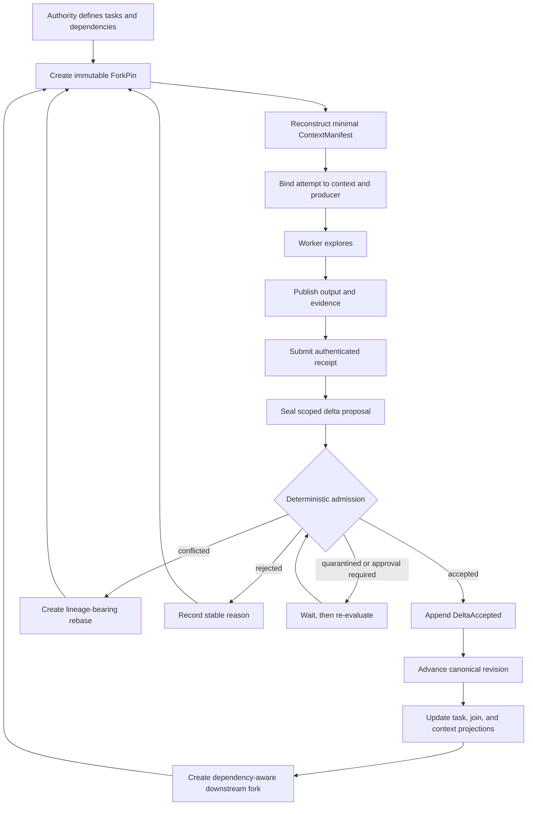

# Horseness Design Principle

## The problem

A main agent plus several specialized subagents can outperform one long-running agent, but only if discoveries become reliable shared state. Free-form handoffs and session summaries are not enough:

- summaries can omit constraints or evidence;
- concurrent workers can overwrite one another's conclusions;
- a conclusion may be valid only for the code and policy version a worker observed;
- later agents cannot reliably reconstruct why the main agent believed something;
- compacting a conversation is lossy and is not deterministic replay.

The main agent's memory therefore cannot be the source of truth.

## Core decision

Horseness moves the main agent's correct working knowledge out of the provider session and into a revisioned, evidence-gated canonical state.

One authorized authority owns that state. Workers explore immutable, dependency-aware forks and return evidence-bearing delta proposals. A proposal cannot modify canonical state directly. Deterministic admission records a decision, and only `DeltaAccepted` advances the canonical revision.

```text
subagent exploration
  -> authenticated output and evidence
  -> sealed delta proposal
  -> evidence-gated admission
  -> canonical working state
  -> deterministic context reconstruction
  -> dependency-aware downstream fork
  -> further exploration
```

This is the product's closed loop.

## The closed loop



## Canonical state, not canonical conversation

The canonical working state is a revisioned document with an authenticated history. Operational facts such as tasks, attempts, receipts, proposals, decisions, and context manifests are durable state around it, but they do not silently change the document.

Only an accepted delta advances the document:

```text
revision N
  + accepted proposal bound to revision N and its state hash
  = revision N + 1
```

This separation keeps exploration noise out of canonical truth. A worker message, model summary, successful process exit, or submitted proposal is not acceptance.

## Immutable exploration forks

Every worker starts from an immutable `ForkPin`. The pin binds:

- the canonical revision, state hash, and canonicalization versions;
- the exact workspace/run observation cursor;
- the dependency and join snapshot visible to the task;
- the worker's allowed canonical delta scope;
- the pinned policy and fork ancestry.

A worker therefore answers against a precise source view. Later receipts, evidence, policy changes, or canonical revisions do not appear in that fork implicitly. Seeing newer state requires an authorized refresh that creates a new pin version with lineage; it never mutates the old pin.

This prevents two common failures:

1. a stale worker silently applying a conclusion to a newer state;
2. a retry receiving a different context while pretending to be the same attempt.

## Evidence-gated deltas

A worker reports a disagreement with canonical state as a typed proposal, not as an unstructured instruction to the main agent.

The proposal binds:

- its base revision and state hash;
- the exact `ForkPin` and delta authority scope;
- attempt and receipt lineage;
- evidence visible when the proposal was sealed;
- ordered operations with explicit value preconditions;
- author, grant, policy, cursor, and version identities.

Admission checks, in fixed order:

1. schema, version, canonical encoding, and proposal identity;
2. pointer validity, duplicate writes, and overlapping writes;
3. pin binding and per-operation scope containment;
4. receipt, producer, evidence, and artifact authenticity;
5. base revision and operation preconditions;
6. current authorization plus pinned and current policy;
7. rejection of a byte-identical final document.

The result is exactly one of:

- `accepted`;
- `rejected`;
- `conflicted`;
- `quarantined`;
- `approval_required`.

Only `accepted` creates `DeltaAccepted`. Conflict, rejection, quarantine, and approval waiting never advance canonical state.

## Deterministic context reconstruction

Context compaction is treated as a build, not an informal summary.

For a particular task and fork, the orchestrator reconstructs context from durable inputs such as:

- objective and task contract;
- the allowed canonical slice;
- dependency outcomes and join snapshot;
- receipts and evidence visible at the pin;
- unresolved decisions and approvals;
- pinned and current policy information;
- exact host and system instructions;
- versioned compaction summaries;
- renderer configuration and byte budget.

Sources are selected with stable ordering and byte accounting. The result records every selected digest and byte range, every omission, renderer and canonicalizer versions, and the rendered output digest. Token counts are advisory; bytes are authoritative.

The resulting `ContextManifestCoreV1` is bound to the attempt through an immutable `AttemptContextBindingV1`. Restart, replay, or cache loss must reconstruct identical bytes and digests from the same authoritative inputs.

Consequences:

- the main agent can keep a small provider session without losing authoritative history;
- later workers receive only the state relevant to their task and pin;
- a context change necessarily creates a new binding and attempt generation;
- resume or reconciliation of an existing provider operation retains its original binding.

## Dependency-aware continuation

Tasks form a durable directed acyclic graph. Dependencies describe the required upstream outcome rather than relying on conversational ordering. A downstream task becomes schedulable only when every incoming edge is durably satisfied and no source outcome is unknown.

The join snapshot binds the exact upstream task resolutions, winning generations, receipt/result digests, and observation cursor. A downstream `ForkPin` captures that snapshot.

A later repair therefore starts from:

```text
canonical revision
+ authenticated dependency outcomes
+ immutable ForkPin
+ reconstructed task context
```

It does not start from "whatever the main agent currently remembers."

## Main-agent responsibility

The main agent is an authority and coordinator, not an omniscient semantic judge. It owns:

- task and dependency construction;
- authorization and policy administration;
- fork creation and refresh;
- proposal inspection and admission commands;
- conflict, approval, quarantine, and recovery decisions;
- canonical and historical reads.

Workers remain scoped producers. Adapters translate host capabilities but cannot decide admission, widen delta authority, write SQLite directly, or synthesize canonical decisions.

## Why this improves quality

The design primarily improves long-running, concurrent, auditable work:

- discoveries retain evidence and provenance;
- stale assumptions fail as conflicts instead of silently overwriting state;
- context is reproducible rather than remembered;
- retries and resumes preserve attempt identity;
- downstream work begins only from durable upstream outcomes;
- every accepted belief has a canonical revision and replayable history.

The cost is deliberate structure: tasks need contracts and scopes, evidence must be published, and proposals must pass admission. For small one-shot tasks this can be heavier than direct agent use. For multi-agent engineering where later repair must be trustworthy, the additional structure is the point.

## Compact analogy

Horseness combines:

```text
Git-like immutable forks
+ database transactions
+ content-addressed evidence
+ deterministic context builds
+ policy-gated pull requests
+ a dependency-aware task scheduler
```

The governing rule is:

> A worker conclusion is candidate information until it is bound to a fork, scope, receipt, evidence, and preconditions, then accepted by the authority. Only then is it canonical truth.

## Normative references

This document explains intent; it does not redefine contracts. Normative semantics live in:

- [Architecture](architecture.md)
- [Deterministic context reconstruction](context.md)
- [Delivery plan](plan.md)
- [Current progress](progress.md)
