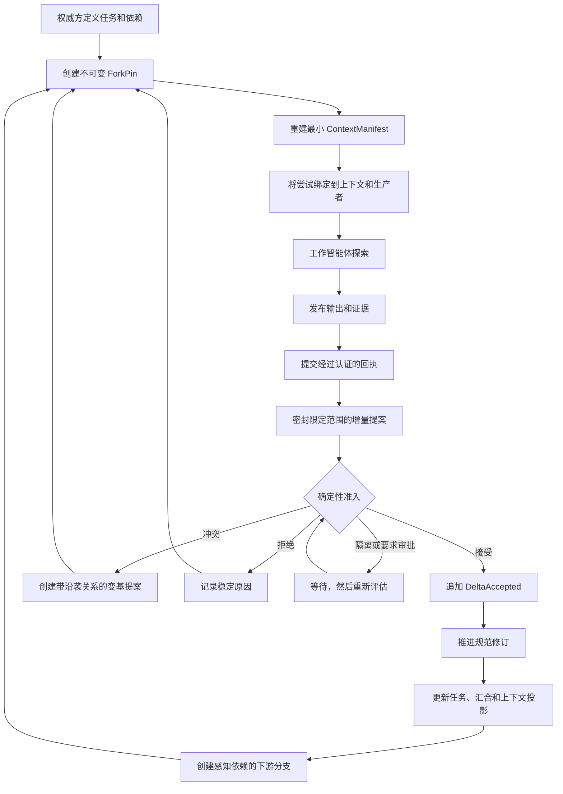

# Horseness 设计原则

## 问题

一个主智能体配合若干专门化子智能体，可能优于单个长时间运行的智能体，但前提是探索结果能够成为可靠的共享状态。自由形式的交接和会话摘要并不足够：

- 摘要可能遗漏约束或证据；
- 并发工作智能体可能互相覆盖结论；
- 一项结论可能只对工作智能体当时观察到的代码和策略版本有效；
- 后续智能体无法可靠地重建主智能体为何相信某件事；
- 压缩对话是有损的，并不等同于确定性重放。

因此，主智能体的记忆不能成为事实来源。

## 核心决策

Horseness 将主智能体的正确工作知识移出供应商会话，放入版本化、证据门控的规范状态中。

由一个经过授权的权威方拥有该状态。工作智能体在不可变、感知依赖的分支上探索，并返回携带证据的增量提案。提案不能直接修改规范状态。确定性准入会记录一项决策，且只有 `DeltaAccepted` 才能推进规范修订。

```text
子智能体探索
  -> 经过认证的输出和证据
  -> 已密封的增量提案
  -> 证据门控准入
  -> 规范工作状态
  -> 确定性上下文重建
  -> 感知依赖的下游分支
  -> 继续探索
```

这就是产品的闭环。

## 闭环



## 规范状态，而非规范对话

规范工作状态是一份具有认证历史的版本化文档。任务、尝试、回执、提案、决策和上下文清单等运行事实，是围绕该文档的持久状态，但不会静默更改文档。

只有被接受的增量才能推进文档：

```text
修订 N
  + 绑定到修订 N 及其状态摘要的已接受提案
  = 修订 N + 1
```

这种分离使探索噪声不会进入规范事实。工作智能体消息、模型摘要、成功的进程退出或已提交提案，都不等同于接受。

## 不可变的探索分支

每个工作智能体都从不可变的 `ForkPin` 开始。该固定点绑定：

- 规范修订、状态摘要和规范化版本；
- 精确的工作区/运行观察游标；
- 任务可见的依赖和汇合快照；
- 工作智能体被允许修改的规范增量范围；
- 固定策略和分支祖先关系。

因此，工作智能体针对一个精确的来源视图作答。后续回执、证据、策略变更或规范修订不会隐式出现在该分支中。要查看较新的状态，必须经过授权地刷新并创建带沿袭关系的新固定点版本；旧固定点永远不会被修改。

这可以防止两种常见故障：

1. 过时的工作智能体将结论静默应用到较新的状态；
2. 重试获得不同的上下文，却仍假装是同一次尝试。

## 证据门控的增量

工作智能体通过类型化提案报告其与规范状态的分歧，而不是向主智能体发送非结构化指令。

提案绑定：

- 基础修订和状态摘要；
- 精确的 `ForkPin` 和增量权限范围；
- 尝试和回执沿袭关系；
- 提案密封时可见的证据；
- 带有显式值前置条件的有序操作；
- 作者、授权、策略、游标和版本身份。

准入按固定顺序检查：

1. 模式、版本、规范编码和提案身份；
2. 指针有效性、重复写入和重叠写入；
3. 固定点绑定以及每项操作是否包含在权限范围内；
4. 回执、生产者、证据和制品的真实性；
5. 基础修订和操作前置条件；
6. 当前授权，以及固定策略和当前策略；
7. 拒绝最终文档字节完全相同的变更。

结果只能是以下一种：

- `accepted`；
- `rejected`；
- `conflicted`；
- `quarantined`；
- `approval_required`。

只有 `accepted` 会创建 `DeltaAccepted`。冲突、拒绝、隔离和等待审批都不会推进规范状态。

## 确定性上下文重建

上下文压缩被视为一次构建，而不是非正式摘要。

对于特定任务和分支，编排器从以下持久输入中重建上下文：

- 目标和任务契约；
- 允许访问的规范切片；
- 依赖结果和汇合快照；
- 固定点处可见的回执和证据；
- 未解决的决策和审批；
- 固定策略和当前策略信息；
- 精确的宿主指令和系统指令；
- 版本化的压缩摘要；
- 渲染器配置和字节预算。

来源按照稳定顺序和字节计量进行选择。结果会记录每个选中来源的摘要和字节范围、每个省略项、渲染器和规范化器版本，以及渲染输出摘要。令牌数仅供参考；字节数才是权威计量。

生成的 `ContextManifestCoreV1` 通过不可变的 `AttemptContextBindingV1` 绑定到尝试。重启、重放或缓存丢失后，必须从相同的权威输入重建出完全相同的字节和摘要。

由此得到：

- 主智能体可以保持较小的供应商会话，而不会丢失权威历史；
- 后续工作智能体只接收与其任务和固定点相关的状态；
- 上下文一旦变化，就必然创建新的绑定和尝试代次；
- 恢复或协调已有供应商操作时，会保留其原始绑定。

## 感知依赖的延续

任务构成持久的有向无环图。依赖描述所需的上游结果，而不是依赖对话顺序。只有每条入边都得到持久满足，且不存在结果未知的来源时，下游任务才可调度。

汇合快照绑定精确的上游任务解决结果、胜出的尝试代次、回执/结果摘要和观察游标。下游 `ForkPin` 会捕获该快照。

因此，后续修复从以下内容开始：

```text
规范修订
+ 经过认证的依赖结果
+ 不可变 ForkPin
+ 重建的任务上下文
```

而不是从“主智能体当前碰巧记得的内容”开始。

## 主智能体的责任

主智能体是权威方和协调者，而不是无所不知的语义裁判。它负责：

- 构建任务和依赖；
- 管理授权和策略；
- 创建和刷新分支；
- 检查提案并发出准入命令；
- 处理冲突、审批、隔离和恢复决策；
- 读取规范状态和历史状态。

工作智能体始终是受范围约束的生产者。适配器负责转换宿主能力，但不能决定准入、扩大增量权限、直接写入 SQLite 或合成规范决策。

## 为什么这能提高质量

该设计主要改善长时间运行、并发且需要审计的工作：

- 探索结果保留证据和来源；
- 过时的假设会以冲突失败，而不是静默覆盖状态；
- 上下文可重现，而不是依赖记忆；
- 重试和恢复会保留尝试身份；
- 下游工作只从持久的上游结果开始；
- 每项被接受的认知都有规范修订和可重放历史。

代价是刻意引入的结构：任务需要契约和范围，证据必须发布，提案必须通过准入。对于小型一次性任务，这可能比直接使用智能体更繁重。对于后续修复必须可信的多智能体工程，这些额外结构正是设计目的。

## 简明类比

Horseness 结合了：

```text
类似 Git 的不可变分支
+ 数据库事务
+ 内容寻址的证据
+ 确定性的上下文构建
+ 策略门控的拉取请求
+ 感知依赖的任务调度器
```

其支配规则是：

> 工作智能体的结论只是候选信息；只有当它绑定到分支、范围、回执、证据和前置条件，并由权威方接受后，才会成为规范事实。

## 规范性参考资料

本文档解释设计意图，不重新定义契约。规范语义位于：

- [架构](architecture.md)
- [确定性上下文重建](context.md)
- [交付计划](plan.md)
- [当前进度](progress.md)
